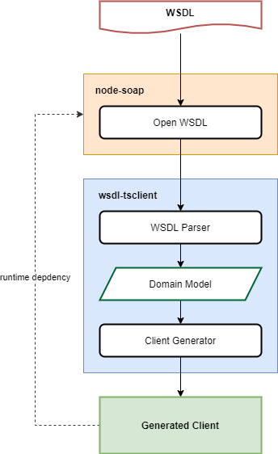

# WSDL TSClient

[](https://travis-ci.org/dderevjanik/wsdl-tsclient)
[](https://npmjs.com/package/wsdl-tsclient)

Generate [soap client](https://www.npmjs.com/package/soap) with typescript definitons from WSDL file.

This library is using [ts-morph](https://www.npmjs.com/package/ts-morph) to generate typescript code and [node-soap](https://github.com/vpulim/node-soap) for runtime. Inspired by Java [wsimport](https://docs.oracle.com/javase/8/docs/technotes/tools/unix/wsimport.html) and [openapi-generator](https://github.com/OpenAPITools/openapi-generator).

*NOTE:* Add `soap` to your npm runtime dependencies (`npm i soap`)

## Install

```sh
npm i wsdl-tsclient
```

or install it with `-g` to have CLI globally available.

```sh
npm i -g wsdl-tsclient
```

## Usage

### Generate client using CLI

`wsdl-tsclient ./soap.wsdl -o ./generated`

`wsdl-tsclient ./resources/**/*.wsdl -o ./generated` - using glob

```bash
Version: 0.3.5
Syntax: wsdl-tsclient [options] [path]

Example: wsdl-tsclient file.wsdl -o ./generated/
         wsdl-tsclient ./res/**/*.wsdl -o ./generated/

Options:
        -h, --help      Print this message
        -v, --version   Print version
        -o              Output dir
        --quiet         Suppress logs
        --verbose       Print verbose logs
        --no-color
```

### Generate client programmatically

```typescript
import { generateClient } from "wsdl-tsclient";

generateClient("MyWsdlClient", "./path/to/wsdl.wsdl", "./generated/soap-client");
```

### Using generated client in your project

*Note:* Make sure you have `soap` package in your runtime dependencies (`npm i soap`)

```typescript
import { createClientAsync } from "./generated/soap-client";

const client = await createClientAsync("./path/to/wsdl.wsdl");
client.CallSoapMethodAsync();
```

for more information about how to use client, read more about [node-soap](https://github.com/vpulim/node-soap)

## How it works

